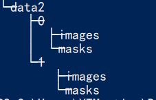

#### U-Net 语义分割

网络及损失来自：[https://github.com/usuyama/pytorch-unet](https://github.com/usuyama/pytorch-unet)

数据集格式：

每个文件夹存放一类，用数字命名（若大于10类，则简单修改MyDataset），每类下原图存放于images文件夹，mask存放于masks文件夹，mask图像为黑（0）白（255）图。